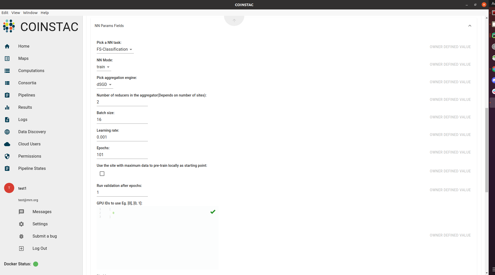

#### Check [here](https://github.com/trendscenter/coinstac-dinunet) for Development guidelines.
#### Running an analysis is the same as [standard COINSTAC computation usage](https://github.com/trendscenter/coinstac-instructions/blob/master/coinstac-how-to-run-analysis.md).
#### Required parameters can be set from the GUI as below:

