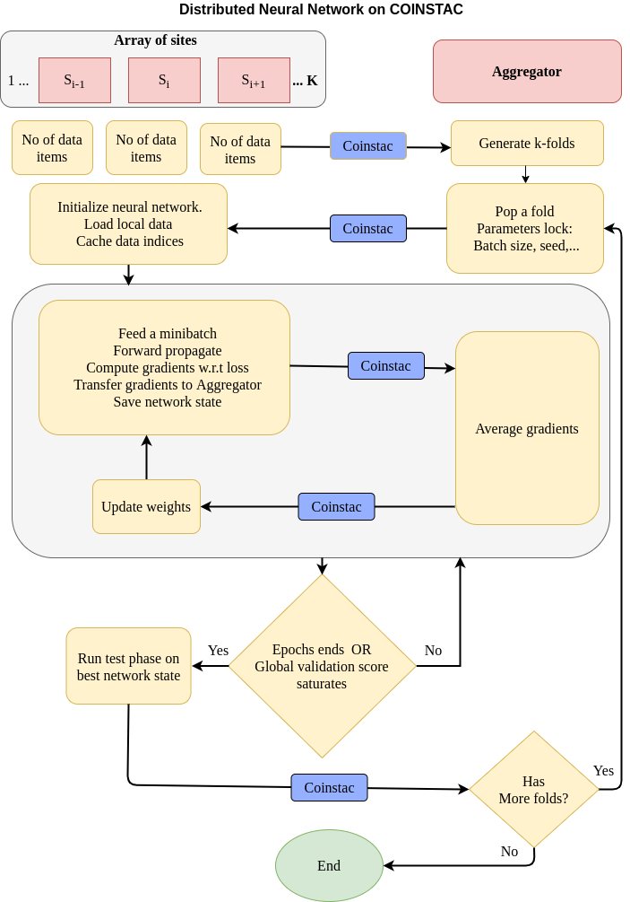

### Structure
* [dinunet/assets](https://github.com/trendscenter/dinunet/tree/master/assets)
* [dinunet/<input_folder_placeholder>](https://github.com/trendscenter/dinunet/tree/master/test) An example for input folder format.
    * [dinunet/inputspec.json](https://github.com/trendscenter/dinunet/blob/master/test/inputspec.json) Input specification for each sites as list of json.
* [dinunet/core](https://github.com/trendscenter/dinunet/tree/master/core)
    * [dinunet/data_parser.py](https://github.com/trendscenter/dinunet/blob/master/core/data_parser.py) is where the data parsing logic goes.
    * [dinunet/measurements.py](https://github.com/trendscenter/dinunet/blob/master/core/measurements.py) GPU implementation of various metrics like Precision, Recall, Fbeta, Accuracy, IOU, and Confusion Matrix
    * [dinunet/models.py](https://github.com/trendscenter/dinunet/blob/master/core/models.py) All neural network models used are to be listed here.
    * [dinunet/torchutils.py](https://github.com/trendscenter/dinunet/blob/master/core/torchutils.py) Utilities involving torch.
    * [dinunet/utils.py](https://github.com/trendscenter/dinunet/blob/master/core/utils.py) General utilities
* [dinunet/classification.py](https://github.com/trendscenter/dinunet/blob/master/classification.py) All logic involving loss function, training, evaluation goes here.
* [dinunet/compspec.json](https://github.com/trendscenter/dinunet/blob/master/compspec.json) Computation specification for COINSTAC.
* [dinunet/Dockerfile](https://github.com/trendscenter/dinunet/blob/master/Dockerfile) Dockerfile capable of GPU access.
* [dinunet/local.py](https://github.com/trendscenter/dinunet/blob/master/local.py) All computation to be run in every sites.
* [dinunet/remote.py](https://github.com/trendscenter/dinunet/blob/remote.py) Receives some information from each sites and sends feed back iteration by iteration.
* [dinunet/requirements.txt](https://github.com/trendscenter/dinunet/blob/master/requirements.txt) Python dependencies.